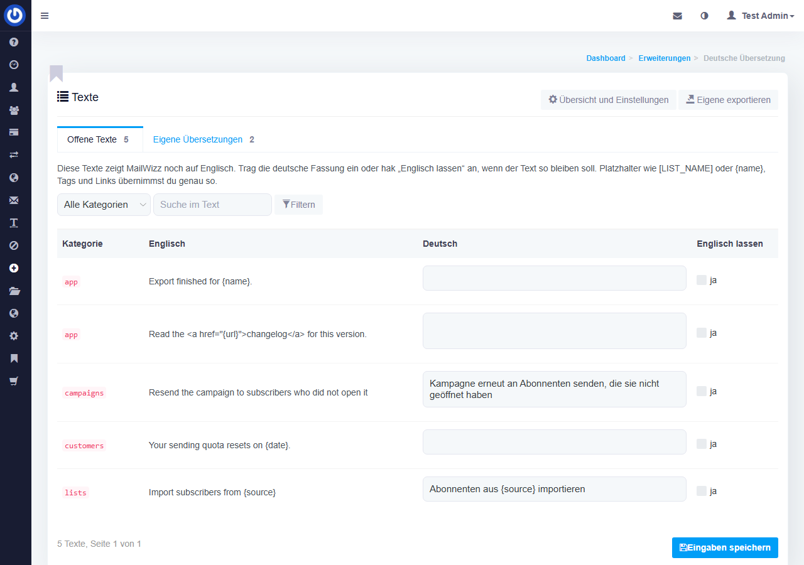
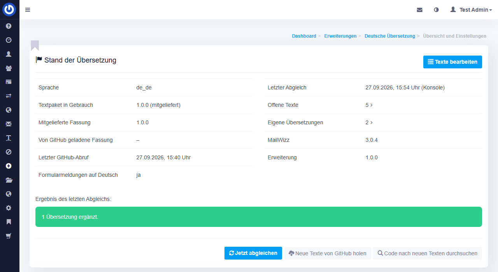

# MailWizz Deutsch

Deutsche Übersetzung für [MailWizz](https://www.mailwizz.com/) 3 als Erweiterung: vollständig, in Du-Form, mit einheitlichen Begriffen, und so gebaut, dass sie Updates übersteht.

[](https://github.com/brightcolor/mailwizz-deutsch/actions/workflows/ci.yml)
[](https://github.com/brightcolor/mailwizz-deutsch/releases/latest)



## Was die Erweiterung macht

- **Übersetzt die ganze Oberfläche.** Rund 6.800 Texte aus Admin- und Kundenbereich, Formularen, Listen, Kampagnen, Einstellungen und Erweiterungen, dazu die Statuswerte und Rechtenamen, die MailWizz erst zur Laufzeit zusammensetzt. Alles in Du-Form nach einem festen [Glossar](GLOSSAR.md): *Versandserver*, *Sperrliste*, *Abonnent*, *Kampagne* heißen überall gleich.
- **Übersetzt die Formularmeldungen.** Fehler wie „Name darf nicht leer sein.“, die Blätterleiste und Upload-Meldungen kommen aus dem Framework und bleiben bei Sprachcodes wie `de_de` sonst englisch.
- **Übersetzt Texte, die MailWizz als Inhalt speichert.** Die Hinweise auf leeren Seiten („Leg deine erste Liste an“), die Einführungstour, die Vorlagen für Anmeldeformular, Bestätigungsseiten und -mails neuer Listen sowie die System-Mails (Passwort zurücksetzen, Bestellungen, Importe …). Diese Texte erreicht die Übersetzungsfunktion von MailWizz nicht.
- **Holt nach, was ein Update überschreibt.** Der stündliche Cronjob prüft, ob Texte fehlen, englisch sind oder in einer älteren Fassung vorliegen, und stellt sie wieder her. Nach einem MailWizz-Update läuft die Prüfung sofort.
- **Findet neue englische Texte.** Texte, die MailWizz anzeigt, die aber noch keine Übersetzung haben, landen in der Liste „Offene Texte“. Nach einem Update durchsucht die Erweiterung zusätzlich den Code. Übersetzt wird direkt im Adminbereich.
- **Aktualisiert sich über GitHub.** Neue Fassungen des Textpakets kommen aus den Veröffentlichungen dieses Repositorys, geprüft über eine SHA-256-Prüfsumme. Eigene Übersetzungen haben immer Vorrang.

## Voraussetzungen

- MailWizz 3.0 oder neuer mit PHP 8.2 oder neuer
- die Sprache „Deutsch“ mit dem Code `de_de` unter *Erweitern → Sprachen*
- die Cronjobs von MailWizz, insbesondere `hourly` (Liste unter *Sonstiges → Cronjobs*)
- für den Abruf neuer Texte: ausgehende HTTPS-Verbindungen zu github.com

## Installation

### Über den Adminbereich

1. Das ZIP [`mailwizz-deutsch.zip`](https://github.com/brightcolor/mailwizz-deutsch/releases/latest/download/mailwizz-deutsch.zip) der neuesten Veröffentlichung herunterladen.
2. In MailWizz *Erweitern → Erweiterungen* öffnen, auf „Erweiterung hochladen“ klicken und das ZIP wählen.
3. Bei „Deutsch“ auf „Aktivieren“ klicken. Beim Aktivieren läuft der erste Abgleich: Übersetzungen, Inhalte und Sprachdateien werden eingespielt.
4. Unter *Erweitern → Sprachen* „Deutsch“ als Standard setzen, falls noch nicht geschehen. Benutzer und Kunden wählen ihre Sprache zusätzlich in ihrem Konto.

### Per SSH

```bash
cd /pfad/zu/mailwizz/apps/extensions
curl -fsSL -o deutsch.zip https://github.com/brightcolor/mailwizz-deutsch/releases/latest/download/mailwizz-deutsch.zip
unzip -q deutsch.zip && rm deutsch.zip
```

Danach die Erweiterung wie oben unter *Erweitern → Erweiterungen* aktivieren. Der Ordner `apps/extensions/deutsch` muss dem Benutzer gehören, unter dem PHP läuft.

### Aktualisieren

- **Texte** kommen von selbst: Die Erweiterung fragt einmal am Tag bei GitHub nach einer neuen Fassung (einstellbar). Sofort geht es mit „Neue Texte von GitHub holen“.
- **Die Erweiterung selbst** wird wie bei der Installation hochgeladen. MailWizz meldet danach, dass die Erweiterung aktualisiert werden muss; ein Klick auf den Link in der Meldung schließt das ab.

## Bedienung

Die Erweiterung hängt sich unter *Erweitern → Deutsche Übersetzung* ein.

| Seite | Wofür |
|---|---|
| **Offene Texte** | Texte ohne deutsche Fassung. Übersetzung eintragen oder „Englisch lassen“ anhaken, dann „Eingaben speichern“. Platzhalter wie `[LIST_NAME]` oder `{name}`, Tags und Links müssen genau so übernommen werden, sonst wird der Text nicht gespeichert. |
| **Eigene Übersetzungen** | Alles, was von Hand übersetzt wurde, hier oder unter *Sprachen → Übersetzungen*. „Paket-Text nutzen“ entfernt die eigene Fassung. „Eigene exportieren“ lädt sie als JSON herunter. |
| **Übersicht und Einstellungen** | Stand der Übersetzung, letzter Abgleich, die Knöpfe „Jetzt abgleichen“, „Neue Texte von GitHub holen“ und „Code nach neuen Texten durchsuchen“ sowie alle Einstellungen. |



Auf der Konsole:

```bash
php apps/console/console.php deutsch-sync            # abgleichen
php apps/console/console.php deutsch-sync --remote=1 # vorher neue Texte von GitHub holen
php apps/console/console.php deutsch-sync --scan=1   # vorher den Code nach neuen Texten durchsuchen
php apps/console/console.php deutsch-sync --dry=1    # nur anzeigen, was sich ändern würde
```

## So bleibt die Übersetzung erhalten

MailWizz 3 liest die Texte der Oberfläche aus der Datenbank (Tabellen `translation_source_message` und `translation_message`), die Sprachdateien unter `apps/common/messages` sind nur Vorlage. Die Erweiterung arbeitet deshalb an der Datenbank und entscheidet bei jedem Abgleich je Text:

| Stand in der Datenbank | Was passiert |
|---|---|
| fehlt, leer oder englisch | wird mit dem Text aus dem Paket gefüllt (oder mit der eigenen Übersetzung) |
| gleich dem Paket | bleibt |
| eine frühere Fassung des Pakets | wird auf die aktuelle Fassung gebracht |
| etwas anderes | gilt als eigene Übersetzung, bleibt stehen und wird nach Updates wiederhergestellt |

Bei den Inhalten (Hinweise, Tour, Listenseiten, System-Mails) ändert die Erweiterung nur, was noch dem englischen Original oder einer früheren Fassung entspricht. Wer eine Vorlage angepasst hat, behält sie. In den System-Mails ersetzt sie einzelne Sätze, damit Seitenname und eigener Slogan im Rahmen erhalten bleiben.

Die Einstellung „Eigene Übersetzungen schützen“ schaltet diesen Schutz ab; dann gilt das Paket überall.

## Einstellungen

| Einstellung | Vorgabe | Bedeutung |
|---|---|---|
| Sprachcode | `de_de` | Sprache, für die eingespielt wird |
| Prüfabstand in Stunden | 1 | so oft prüft der stündliche Cronjob (1–168) |
| Eigene Übersetzungen schützen | Ja | eigene Texte haben Vorrang vor dem Paket |
| Sprachdateien schreiben | Ja | spiegelt die Datenbank nach `apps/common/messages/<Sprache>` |
| Formularmeldungen übersetzen | Ja | Framework-Meldungen aus eigenen Sprachdateien |
| Texte von GitHub laden | Ja | neue Fassungen automatisch holen |
| Adresse der Paketbeschreibung | neueste Veröffentlichung dieses Repositorys | eigene Quelle möglich, nur `https://` |
| GitHub-Abruf alle … Stunden | 24 | 1–720 |
| Wartezeit beim Abruf in Sekunden | 20 | 5–120 |
| Größte Download-Datei in MB | 20 | Schutz gegen übergroße Dateien (1–100) |
| Fehlende Texte erfassen | Ja | unbekannte Texte landen unter „Offene Texte“ |
| Erfassen in diesen Bereichen | `backend,customer` | außerdem möglich: `frontend`, `api` |
| Code nach Updates durchsuchen | Ja | neue Texte einer MailWizz-Version finden |
| Hinweise leerer Seiten / Einführungstour / Vorlagen für Listenseiten / System-Mails übersetzen | Ja | je Inhaltsbereich abschaltbar |
| Texte pro Seite | 50 | Länge der Textlisten (10–500) |

## Was die Erweiterung ändert

- Übersetzungen der eingestellten Sprache in `translation_source_message` und `translation_message`
- die Sprachdateien in `apps/common/messages/<Sprache>` (abschaltbar)
- Einträge in `start_page`, `tour_slideshow_slide`, `list_page_type` und `common_email_template`, solange sie den englischen Originaltext tragen
- eine eigene Tabelle `deutsch_ext_own` mit den eigenen Übersetzungen
- den Ordner `apps/common/runtime/deutsch-ext` für geladene Texte und die Framework-Sprachdateien

Deaktivieren lässt alle Übersetzungen stehen. Löschen entfernt zusätzlich die eigene Tabelle und die Einstellungen der Erweiterung; die Übersetzungen in der Datenbank bleiben.

## Texte verbessern

Verbesserungen sind willkommen, als Pull Request oder Issue.

- Die Übersetzungen liegen als MailWizz-Sprachdateien in [`source/messages/de_de`](source/messages/de_de), eine Datei je Kategorie.
- Die Inhalte (Hinweise, Tour, Listenseiten, System-Mails) liegen in [`source/content`](source/content).
- Frühere Fassungen, die die Erweiterung automatisch ersetzen darf, stehen in [`source/history/messages.php`](source/history/messages.php).
- Die Begriffe stehen im [Glossar](GLOSSAR.md).

Vor dem Pull Request:

```bash
php tools/build.php   # Textpaket bauen (translations/ und deutsch/data/)
php tools/check.php   # Begriffe gegen das Glossar prüfen
php tests/run.php     # Tests
```

Manche Hinweise in MailWizz zeigen Beispielschlüssel, etwa ein Muster für einen AWS-Schlüssel. Der Push-Schutz von GitHub hält sie für echte Zugangsdaten. `php tools/mask-sources.php` teilt solche Zeichenfolgen in den Quellen in mehrere Teile, der Build maskiert sie im Textpaket; der Text bleibt dabei gleich.

Eigene Übersetzungen aus einer Installation lassen sich unter *Deutsche Übersetzung → Eigene exportieren* als JSON herunterladen und an ein Issue hängen.

## Aufbau

```
deutsch/                  die Erweiterung (kommt nach apps/extensions/deutsch)
  DeutschExt.php          Einstieg: Einhängepunkte, Cronjob, Seiten
  common/lib/             Logik ohne MailWizz-Abhängigkeit (getestet)
  common/components/      Datenbank, GitHub-Abruf, Abgleich, Erfassen fehlender Texte
  backend/                Seiten im Adminbereich
  console/                Konsolenbefehl deutsch-sync
  data/de_de.json         mitgeliefertes Textpaket
source/                   Quellen der Texte
translations/             gebautes Textpaket und Paketbeschreibung (manifest.json)
tools/                    Build, Glossar-Prüfung, Teilen von Beispielschlüsseln
tests/                    Tests ohne Abhängigkeiten
```

## Lizenz

[MIT](LICENSE). MailWizz ist eine Marke ihrer Inhaber; dieses Projekt entsteht unabhängig davon.
